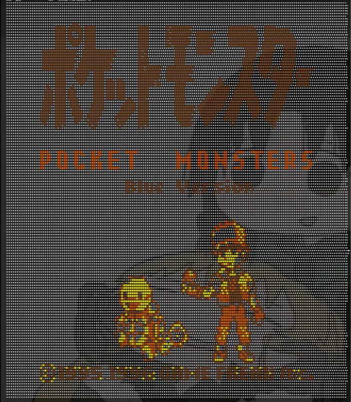
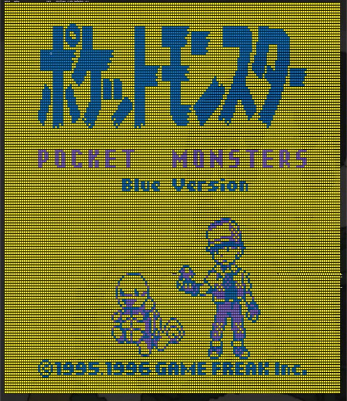
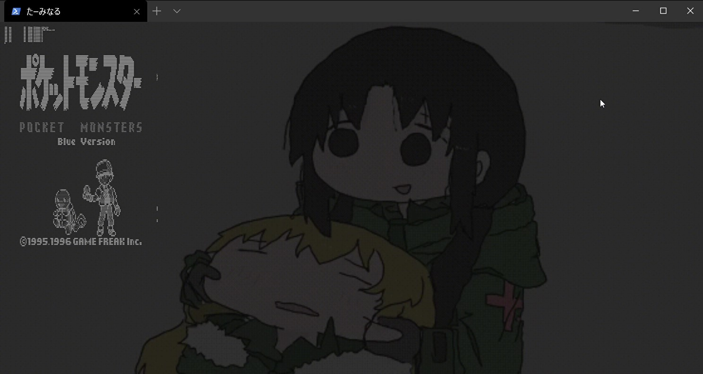

# Gameboy-on-terminal

ターミナル上でゲームボーイが動くやつ

## 機能

- いくつかのカラーパレット
- fpsの調整

※まだ操作ができません。

**hot**

**cool**

**dot**

## 使い方

起動：`python main.py path/to/ROM.gb`

カラーパレットの指定：`python main.py path/to/ROM "parret_name"`

※`"parret_name": hot, cool, mono, dot`

## 必要なもの

- Python 3.6 or 3.7
- Terminal (絵文字対応しているもの)
- `pyboy`
- `numpy`
- gameboy の ROM(`.gb`)

